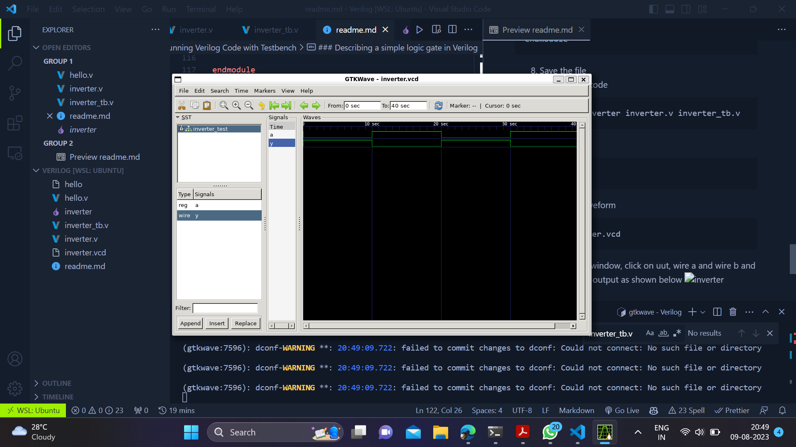

# Verilog HDL
## Installing Icarus Verilog on Ubuntu
1. First update and upgrade your system
```bash
sudo apt update && upgrade
```
2. Install Icarus Verilog
```bash
sudo apt install iverilog
```
3. Check the version of Icarus Verilog
```bash
iverilog -v
```
4. Install GTKWave
```bash
sudo apt install gtkwave
```
5. Check the version of GTKWave
```bash
gtkwave -v
```
## Compiling and Running Verilog Code
1. Create a new directory
```bash
mkdir verilog
```
2. Change directory
```bash
cd verilog
```
3. Create a new file
```bash
touch hello.v
```
4. Open the file with vs code
```bash
code .
```
5. Write the code
```verilog
module hello;

initial 
    $display("Hello Verilog!");

endmodule
```
6. Save the file
7. Compile the code
```bash
iverilog -o hello hello.v
```
8. Run the code
```bash
vvp hello
```
## Compiling and Running Verilog Code with Testbench
### Describing a simple logic gate in Verilog
1. Create a new directory
```bash
mkdir inverter_gate
```
2. Change directory
```bash
cd inverter_gate
```
3. Create a new file (you can create a new file with vs code also)
```bash
touch inverter.v
```
4. Open the file with vs code
```bash
code .
```
5. Write the code
```verilog
module inverter(
    input a,
    output y
);

not(y,a);

endmodule
```
6. Save the file
7. Create a new file
```bash
touch inverter_tb.v
```
write the code
```verilog
module inverter_test;

reg a;
wire y;

inverter uut(a,y);

initial begin
    $dumpfile("inverter.vcd");
    $dumpvars(0,inverter_test);

    a = 0;
    #10
    a = 1;
    #10 
    a = 0;
    #10
    a = 1;
    #10
    $finish();
end


endmodule
```
8. Save the file
9. Compile the code
```bash
iverilog -o inverter inverter.v inverter_tb.v
```
10. Run the code
```bash
vvp inverter
```
11. Open the waveform
```bash
gtkwave inverter.vcd
```
12. On GTKwave window, click on uut, wire a and wire b and you'll see the output as shown below


